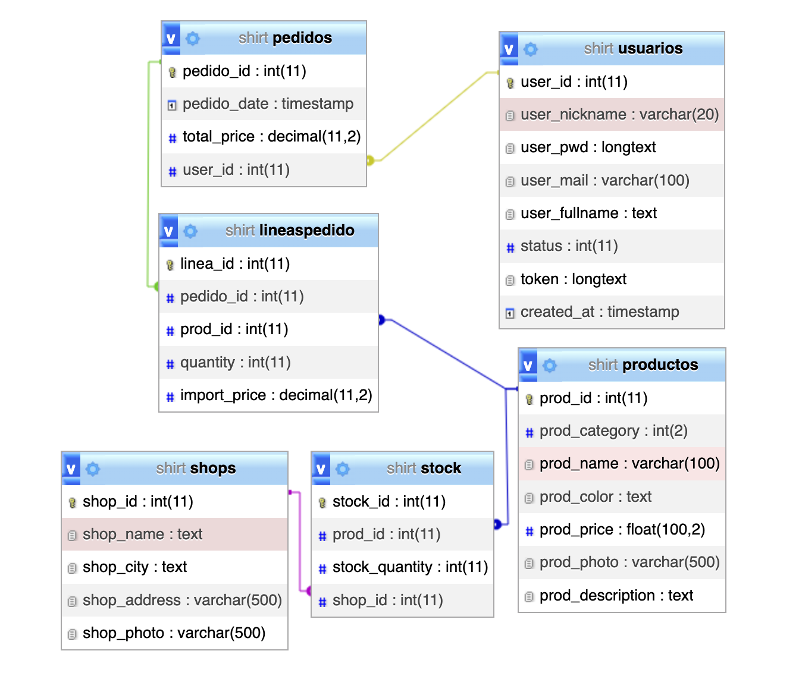

# Tu-Shirt! :tshirt:

**Tu-Shirt!** es una página web que gestiona una tienda online de camisetas y totebags con frases ingeniosas estampadas. Permite a los usuarios registrase y tener un perfil personal, navegar por el catálogo, ver los puntos de venta, consultar si hay stock en estas tiendas, añadir productos al carrito y finalizar el pedido. La aplicación está construida utilizando un enfoque **MVC (Model-View-Controller)** con **Programación Orientada a Objetos (POO)**, lo que asegura una estructura organizada y escalable. Además tiene un diseño adaptable a diferentes dispositivos.

## Web

Puedes visitar la web en este [link](http://147.83.7.203/cristina/shirts/index.php).
Tambien copiando esta URL:
http://147.83.7.203/cristina/shirts/index.php

## Tabla de Contenidos

- [Arquitectura MVC y POO](#arquitectura-mvc-y-poo)
- [Tecnologías](#tecnologías)
- [Base de Datos](#base-de-datos)
- [Instalación](#instalación)
- [Uso](#uso)
- [Créditos](#créditos)

## Arquitectura MVC y POO

Este proyecto sigue el patrón de diseño **MVC (Model-View-Controller)**, lo que facilita la separación de responsabilidades y hace que el código sea más mantenible.

La **POO** es un paradigma de programación que permite estructurar el código en objetos, los cuales contienen tanto datos como métodos para manipular esos datos. En este proyecto, cada entidad (Producto, Usuario, etc.) está representada como una clase con propiedades y métodos que encapsulan su comportamiento.

Esto hace que el código sea más modular, reutilizable y fácil de mantener.

---

## Tecnologías

El desarrollo de **Tu-Shirt!** ha sido realizado utilizando las siguientes tecnologías:

- **PHP**: Lenguaje del lado del servidor para gestionar la lógica de la aplicación.
- **PHP mailer**: Biblioteca para el envío de correos electrónicos, utilizada en la notificación de pedidos.
- **MySQL**: Sistema de gestión de bases de datos relacional para almacenar la información de productos, usuarios y pedidos.
- **CSS3**: Para el estilo visual de la aplicación.
- **Bootstrap**: Framework de CSS para facilitar el diseño responsivo y la usabilidad.
- **HTML5**: Lenguaje de marcado para estructurar las páginas web.
- **JavaScript**: Lenguaje de programación del lado del cliente para mejorar la interactividad de la interfaz de usuario.

---

## Base de Datos

A continuación se muestra una imagen del modelo de la base de datos que se utiliza en **Tu-Shirt!**, la cual contiene las tablas necesarias para gestionar los usuarios, productos, pedidos, entre otras.



> Para ver la imagen en tamaño completo, haz clic [aquí](documents/db.png).

---

## Instalación

Para ejecutar este proyecto de manera local, sigue estos pasos:

1. Clona el repositorio:

   ```bash
   git clone https://github.com/Crisktina/shirts
   ```

2. Configura la base de datos:

   - Importa el archivo SQL incluido en el proyecto (`shirt.sql`) para crear las tablas necesarias en tu base de datos MySQL.
   - Asegúrate de configurar correctamente los datos de conexión a la base de datos en el archivo de configuración.

3. Configura **PHP mailer**:

   - Edita el archivo de configuración de **PHP mailer** con los detalles de tu servidor de correo electrónico (puedes usar servicios como Gmail o un servidor SMTP propio).

4. Ejecuta el servidor:

   ```bash
   php -S localhost:8000
   ```

---

## Uso

1. Visita la web en este [link](http://147.83.7.203/cristina/shirts/index.php). En el caso de que hayas instalado el repositorio de Github visita `http://localhost:8000` en tu navegador.
2. Navega por el catálogo de productos sin necesidad de registrar-te como usuario.
   
3. Registra-te como usuario y haz login.
   
   
4. Visita tu perfil, puedes modificar tus datos de usuario.
   
5. En el apartador nuestras tiendas, puedes ver las tiendas de venta del producto. Además en cada detalle de producto te dice si hay stock en ellas.
   
6. Añade productos al carrito y finaliza tu pedido.
   
7. Si has olvidado tu password la puedes recuperar.
   
   

---

## Créditos

Este proyecto ha sido desarrollado por [Cristina Hidalgo](https://github.com/Crisktina) como parte de un ejercicio de aprendizaje de **desarrollo web** para el curso IFCD0210 - FOAP de Desarrollo de aplicaciones con tecnología web.
Puedes visitar el repositorio completo en este [link](https://github.com/Crisktina/shirts).
Puedes visitar la web en este [link](http://147.83.7.203/cristina/shirts/index.php).
